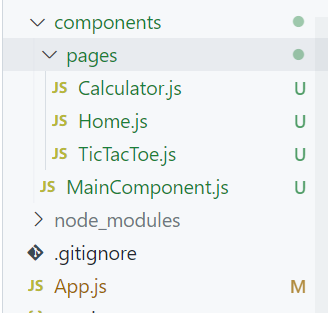

# Dependencies

## React Native Elements

`npm install react-native-elements react-native-vector-icons react-native-safe-area-context`

## React Navigation

`npm install @react-navigation/native`

`expo install react-native-screens react-native-safe-area-context`

### For Drawer Navigation

`npm install @react-navigation/drawer`

`expo install react-native-gesture-handler react-native-reanimated`

---
## Update App.js

```JavaScript
import React from 'react';
import { SafeAreaProvider } from 'react-native-safe-area-context';
import MainComponent from './components/MainComponent';

export default function App() {
  return (
    <SafeAreaProvider>
      <MainComponent />
    </SafeAreaProvider>
  );
}
```

## Make following directory structure


## Update Home, Calculator, TicTacToe using `rnfe`

```JavaScript
import React from 'react'
import { View, Text } from 'react-native'

const Home = () => {
    return (
        <View>
            <Text>Home Pge</Text>
        </View>
    )
}

export default Home

```